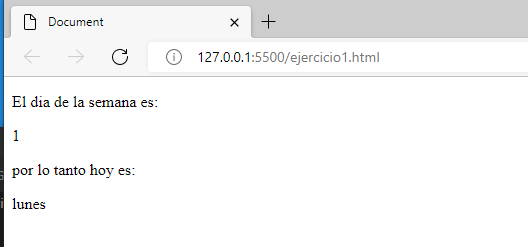
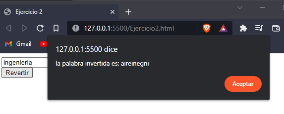
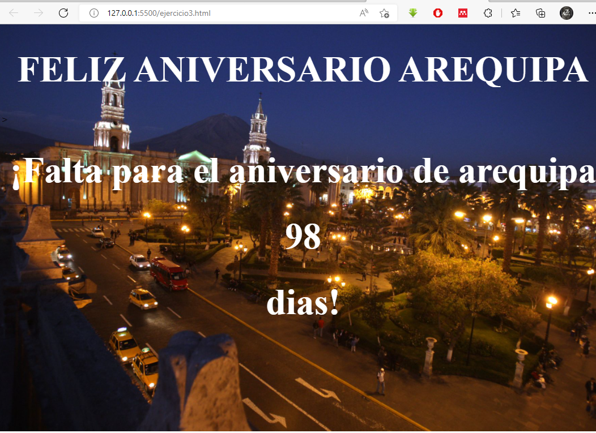
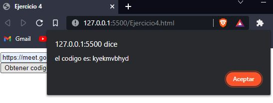
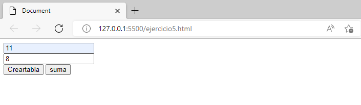
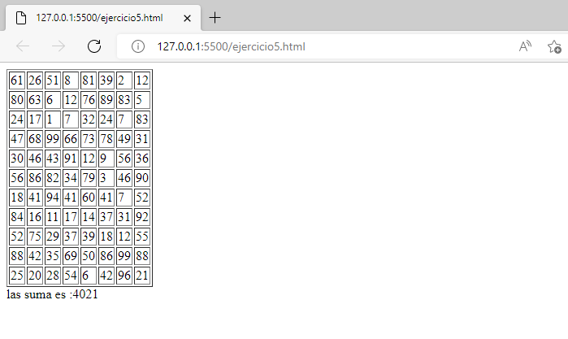
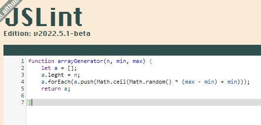

<table>
    <theader>
        <tr>
            <td></td>
            <th>
                UNIVERSIDAD NACIONAL DE SAN AGUSTIN 
                FACULTAD DE INGENIERÍA DE PRODUCCIÓN Y SERVICIOS 
                ESCUELA PROFESIONAL DE INGENIERÍA DE SISTEMAS
            </th>
            <td></td>
        </tr>
    </theader>
    <tbody>
        <tr><td colspan="3">Formato: Guía de Práctica de Laboratorio / Talleres / Centros de Simulación</td></tr>
        <tr><td>Aprobación:  2022/03/01</td><td>Código: GUIA-PRLD-001</td><td>Página: 1</td></tr>
    </tbody>
</table>

<table>
<theader>
<tr><th colspan="6">INFORMACIÓN BÁSICA</th></tr>
</theader>
<tbody>
<tr><td>ASIGNATURA:</td><td colspan="5">Programación Web 2</td></tr>
<tr><td>TÍTULO DE LA PRÁCTICA:</td><td colspan="5">JavaScript</td></tr>
<tr>
<td>NÚMERO DE PRÁCTICA:</td><td>02</td><td>AÑO LECTIVO:</td><td>2022 A</td><td>NRO. SEMESTRE:</td><td>III</td>
</tr>
<tr>
<td>FECHA DE PRESENTACION:</td><td>02-may-2022</td><td>HORA DE PRESENTACION</td><td>06-may-2022</td><td>DURACIÓN:</td><td>04 horas</td>
</tr>
<tr>
<td>ESTUDIANTES:</td><td colspan ="3"><li>Luis Ayben Chahua Charca</li><li>Luis Fernando Chambi Orosco</li> </td><td>NOTA:</td><td ></td>

</tr>
<tr><td colspan="6">DOCENTES:
<ul>
<li>Richart Smith Escobedo Quispe</li>
</ul>
</td>
</<tr>
</tdbody>
</table>

GUÍA DE LABORATORIO 
(formato estudiante)

## EJERCICIOS PROPUESTOS
- Ejercicio 01: Escriba una función que reciba el número de día de la fecha actual new Date() - https://www.w3schools.com/jsref/jsref_obj_date.asp  y devuelva el texto del día de la semana correspondientes. Por ejemplo si recibe 0, devolvería “Domingo”.

El codigo del ejercicio es: ejercicio1.html
<td></td>

- Ejercicio 02: Escriba una página web que reciba un texto y al presionar un botón muestre el mismo texto invertido en otra sección (div). Por ejemplo si se escribe “Hola”, se mostraría como “aloH”.

se ejecuta en ejercicio2.html y trabaja con ejercicio2.js
<td></td>

- Ejercicio 03: Escribir una página que muestre cuántos días faltan para el día de Arequipa!

El codigo del ejercicio es: ejercicio3.html
<td></td>

- Ejercicio 04: Escribir un página que reciba el URL de la sesión de google meet de hoy y devuelva el código de la sesión sin guiones separadores

se ejecuta en ejercicio4.html y trabaja con ejercicio4.js
<td></td>

- Ejercicio 05: Escribir una página que permita calcular las suma de todos los valores de una tabla de valores dinámica. La idea es crear una página web con un formulario que te permita decir cuantos valores tendrá la tabla, luego, al enviar el formulario la tabla se debe crear dinámicamente, junto con otro botón de envió para calcular la suma.

El codigo del ejercicio es: ejercicio5.html
<td></td>
<td></td>

- Ejercicio 06: Utilice la herramienta flipgrid - https://info.flipgrid.com/ envie un video en el tema "Presentacion y ejemplo deJavaScript" ponga aquí los enlaces de sus envíos.

Chambi Orosco Luis Fernando JS Variables enlace - https://flipgrid.com/a9ddad0c

Chahua Charca Luis Ayben JS Comments enlace - https://flipgrid.com/d3a72abd

##  2 SOLUCION DEL CUESTIONARIO 

- Pruebe este código de arrayGenerator() en la página https://jslint.com/

con respecto al codigo original, se uso "n" para asignar un leght al array y se cambio el bucle for "for" por el metodo a.forEach(); para llenar los datos. 
<td></td>

- Revisar esta discusión en stackoverflow - https://stackoverflow.com/questions/4852017/how-to-initialize-an-arrays-length-in-javascript

    - ¿Cómo se pueden resolver los warnings
    la inicializacion de arrays en javascript no se necesita especificar el tipo, basta con let y []. 
    - ¿Se puede modificar la solución usando map? ¿Cómo?
    no, maps se utiliza para la iteracion y reemplazo de los datos de un array, no para declararlos.

## 3 CONCLUSIONES

El trabajo fue bastante instructivo, ayudandonos a entender la extension de funciones de javascript, su simplicidad y en general para un buen uso de este lenguaje, que ayuda mucho en html.

## RETROALIMENTACION GENERAL 

-

## REFERENCIAS Y BIBLIOGRÁFIA 
Javascript tutorial. https://www.w3schools.com/javascript/default.asp, 2021. Accesed: 02-09-2021.
Loiane Groner. Learning JavaScript Data Structures and Algorithms: Write complex and powerful
Validador HTML - https://validator.w3.org/
Validador CSS - https://jigsaw.w3.org/css-validator/

[license]: https://img.shields.io/github/license/rescobedoq/pw2?label=rescobedoq
[license-file]: https://github.com/rescobedoq/pw2/blob/main/LICENSE

[downloads]: https://img.shields.io/github/downloads/rescobedoq/pw2/total?label=Downloads
[releases]: https://github.com/rescobedoq/pw2/releases/

[last-commit]: https://img.shields.io/github/last-commit/rescobedoq/pw2?label=Last%20Commit

[Debian]: https://img.shields.io/badge/Debian-D70A53?style=for-the-badge&logo=debian&logoColor=white
[debian-site]: https://www.debian.org/index.es.html

[Git]: https://img.shields.io/badge/git-%23F05033.svg?style=for-the-badge&logo=git&logoColor=white
[git-site]: https://git-scm.com/

[GitHub]: https://img.shields.io/badge/github-%23121011.svg?style=for-the-badge&logo=github&logoColor=white
[github-site]: https://github.com/

[Vim]: https://img.shields.io/badge/VIM-%2311AB00.svg?style=for-the-badge&logo=vim&logoColor=white
[vim-site]: https://www.vim.org/

[Java]: https://img.shields.io/badge/java-%23ED8B00.svg?style=for-the-badge&logo=java&logoColor=white
[java-site]: https://docs.oracle.com/javase/tutorial/

[![Debian][Debian]][debian-site]
[![Git][Git]][git-site]
[![GitHub][GitHub]][github-site]
[![Vim][Vim]][vim-site]
[![Java][Java]][java-site]

[![License][license]][license-file]
[![Downloads][downloads]][releases]
[![Last Commit][last-commit]][releases]
